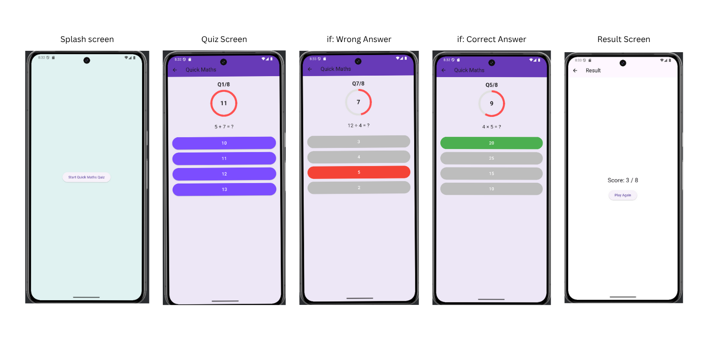

# 🧠 QuizApp - Flutter Math Quiz

A lightweight Flutter app that challenges users with simple math problems under a time limit. Ideal for sharpening basic arithmetic skills in a fun and engaging way.

---

## 🧭 App Screen Flow



---

## 📽️ App Demo Video

[▶ Watch Demo Video](assets/app_demo.mp4)

---

## 🎯 Features

- 🧮 **Math Questions** – Addition, subtraction, multiplication, and more
- ⏳ **Timed Questions** – Each problem must be solved within a countdown
- ✅ **Score Tracking** – Instant feedback on answers and score updates
- 🔁 **Replay Option** – Try again with a new set of randomized problems

---

## 🚀 Getting Started

### 📦 Prerequisites

- Flutter SDK (3.x)
- Android Studio / VS Code

### 🔧 Installation

```bash
git clone https://github.com/Lekhika-Regmi/QuizApp_flutter.git
cd QuizApp_flutter
flutter pub get
flutter run
